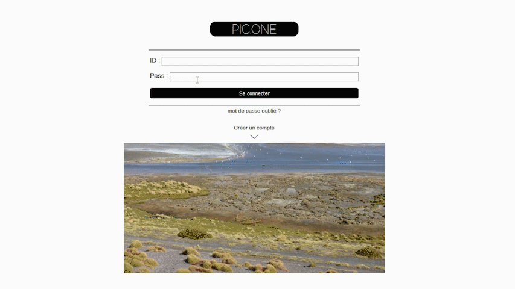

# instagram-42
## My very first big project
<dl>
  <dt>How long did it take ?</dt>
  <dd>2 months</dd>

  <dt>What did I learn ?</dt>
  <dd>
  * object-oriented programming in php
  * javascript
  * ajax
  * responsive design and advanced CSS tricks
  * authentication process in backend and frontend
  * docker LAMP
  * how to send email with php
  * how to handle webcam, upload images and edit them with php and javascript
  </dd>
</dl>

